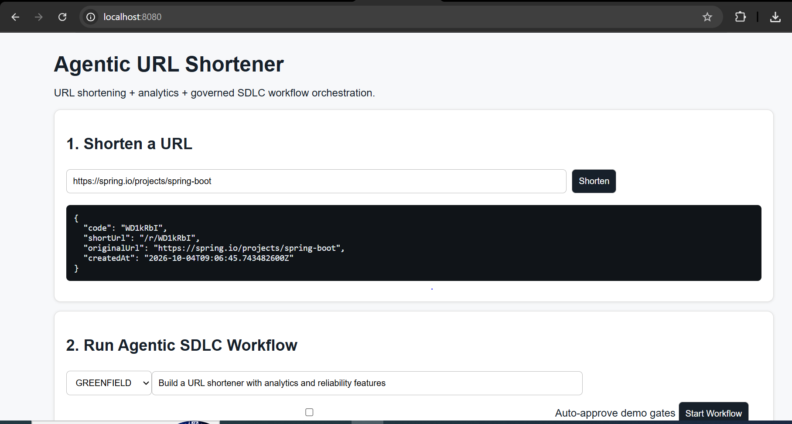
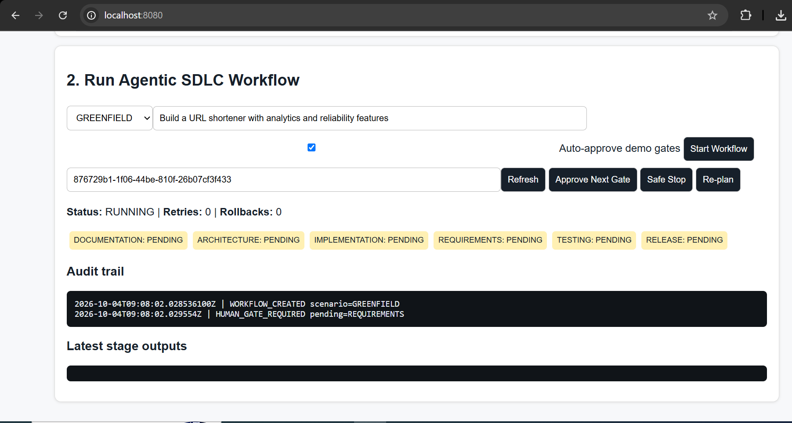
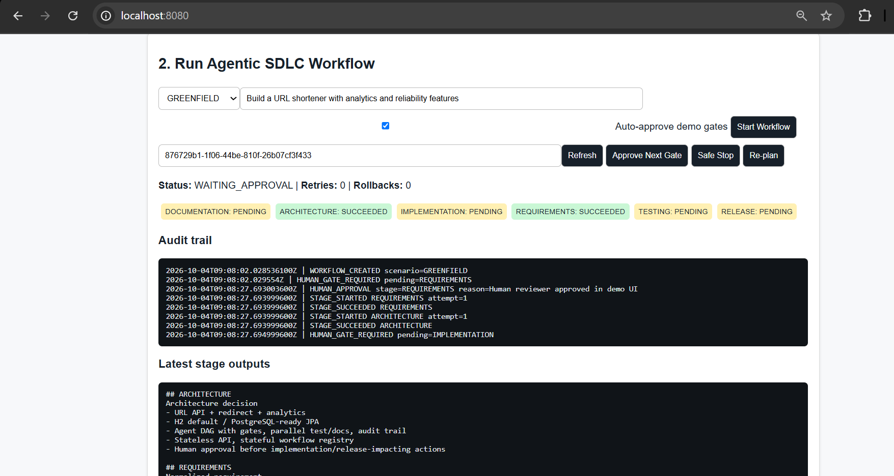
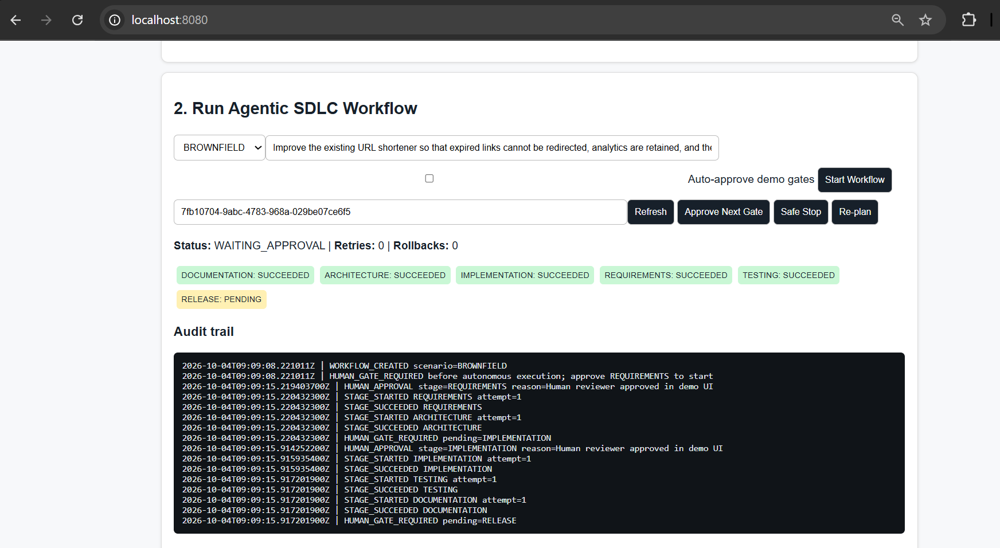
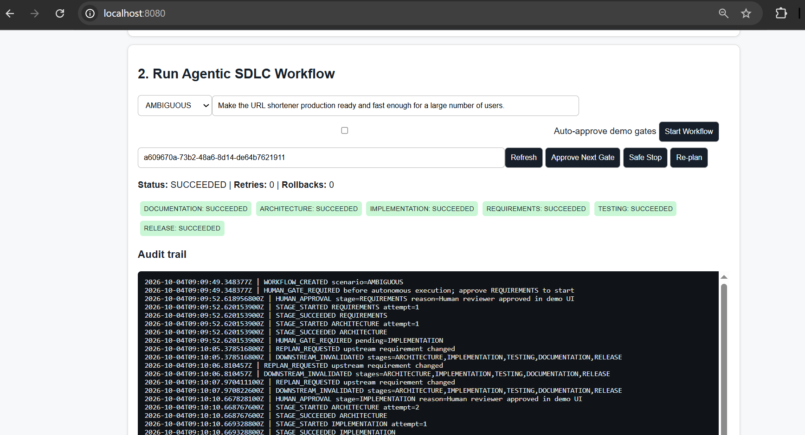

# Agentic URL Shortener — Testing Guide

This document provides step-by-step instructions to test the Agentic URL Shortener application, including both the URL shortening functionality and the Agentic Orchestrator workflows.

---

## 1. Open the UI

Navigate to:

```
http://localhost:8080/
```

You should see the **Agentic URL Shortener UI** with two main sections:

- **URL Shortener** — Create and redirect short URLs
- **Agentic Orchestrator** — Execute SDLC scenarios

---

## Part A — Test URL Shortener

### Step 1: Create a Short URL

Use the following sample:

| Field | Value |
|-------|-------|
| **Long URL** | `https://www.google.com/search?q=Schwab+Agentic+Engineering` |

1. Enter the URL in the URL field
2. Click **Shorten**

**Expected Result:**

```
http://localhost:8080/r/abc123
```

> The actual code will be different.

### Step 2: Test the Short URL

1. Copy the generated short URL
2. Open it in a new browser tab:

```
http://localhost:8080/r/abc123
```

**Expected Result:** You should be redirected to:

```
https://www.google.com/search?q=Schwab+Agentic+Engineering
```

**This confirms the following flow:**

```
Browser
    ↓
Short URL
    ↓
Spring Boot
    ↓
Database lookup
    ↓
Original URL
    ↓
HTTP Redirect
```

---

## Part B — Test Additional URLs

Create short URLs for the following:

1. `https://www.github.com/`
2. `https://spring.io/projects/spring-boot`
3. `https://www.oracle.com/java/`

**For each:**

1. Create a short URL
2. Open the generated URL
3. Verify redirection works correctly

---

## Part C — Test Analytics

1. After creating a short URL (e.g., `http://localhost:8080/r/X7ab91`), open it **5 times**
2. Refresh the **Analytics** section in the UI

**Expected Result:**

```
Clicks: 5
```

This demonstrates the analytics requirement.

---

## Part D — Test the Agentic Orchestrator

> **This is the most important part of the assignment.**

Locate the **Agentic Orchestrator** section in the UI. You should see fields similar to:

- **Scenario**
- **Requirement**
- **Auto Approve**
- **Run Workflow**

### Scenario 1 — Greenfield

**Configuration:**

| Field | Value |
|-------|-------|
| **Scenario** | `GREENFIELD` |
| **Requirement** | Build a URL shortener that accepts a long URL, generates a unique short code, redirects users to the original URL, and records click analytics. |
| **Auto Approve** | `ON` |

**Action:** Click **Run Workflow**

**Expected Execution Flow:**

```
REQUIREMENTS
    ↓
ARCHITECTURE
    ↓
IMPLEMENTATION
    ↓
┌──────────────┐
↓              ↓
TESTING    DOCUMENTATION
↓              ↓
└───────┬──────┘
    ↓
RELEASE
```

> **Note:** Testing and Documentation execute **in parallel**.

---

### Scenario 2 — Brownfield

**Configuration:**

| Field | Value |
|-------|-------|
| **Scenario** | `BROWNFIELD` |
| **Requirement** | Improve the existing URL shortener so that expired links cannot be redirected, analytics are retained, and the API returns clear errors for invalid or expired short codes. |

**Action:** Click **Run Workflow**

This demonstrates that the agent can reason about an **existing system**, rather than only generating a greenfield implementation.

---

### Scenario 3 — Ambiguous Requirement

> **This is particularly important for your interview.**

**Configuration:**

| Field | Value |
|-------|-------|
| **Scenario** | `AMBIGUOUS` |
| **Requirement** | Make the URL shortener production ready and fast enough for a large number of users. |

**Action:** Click **Run Workflow**

**Expected Behavior:** The agent should identify missing clarifications, such as:

- What does "large number" mean?
- What is the expected latency?
- How many requests per second?
- How long should URLs live?
- Should URLs expire?
- What analytics are required?
- What is the availability target?
- What authentication is required?
- What are the security constraints?

> **Interview Focus:** This demonstrates **requirement clarification/normalization** — a key area interviewers are likely to focus on.

---

## Part E — View Workflow/Audit Information

After executing a workflow, review the workflow information. You should see:

- **Workflow ID**
- **Scenario**
- **Status**
- **Current Stage**
- **Stages**
- **Approvals**
- **Retries**
- **Rollbacks**
- **Audit Events**

**Example:**

```
Workflow ID: 8f42d9e1-...
Scenario:    GREENFIELD
Status:      COMPLETED
Retries:     0
Rollbacks:   0
```

**Sample Audit Events:**

```
WORKFLOW_STARTED
REQUIREMENTS_STARTED
REQUIREMENTS_COMPLETED
ARCHITECTURE_STARTED
ARCHITECTURE_COMPLETED
IMPLEMENTATION_STARTED
IMPLEMENTATION_COMPLETED
TESTING_STARTED
DOCUMENTATION_STARTED
TESTING_COMPLETED
DOCUMENTATION_COMPLETED
RELEASE_STARTED
RELEASE_COMPLETED
WORKFLOW_COMPLETED
```

> **Emphasize:** This demonstrates **audit-grade traceability**.

---

## Part F — Test Human Approval

> **This is an important interview demonstration.**

**Configuration:**

| Field | Value |
|-------|-------|
| **Auto Approve** | `OFF` |
| **Scenario** | `GREENFIELD` |

**Action:** Click **Run Workflow**

**Expected Behavior:** The workflow should reach an **approval checkpoint** rather than automatically executing a high-impact stage.

**Conceptual Flow:**

```
Requirements
    ↓
Architecture
    ↓
Implementation
    ↓
[ HUMAN APPROVAL ]
    ↓
Testing
    ↓
Documentation
    ↓
Release
```

**Explanation for Interviewers:**

> Agents can prepare and execute bounded work, but **high-impact actions remain subject to human approval**. This is directly aligned with the assignment's **controlled autonomy** requirement.

---

## Part G — Sample Requirements for Demo

Use these requirements during your demonstration:

| Type | Requirement |
|------|-------------|
| **Greenfield** | Build a URL shortening service that accepts long URLs, creates unique short codes, redirects users, and tracks clicks. |
| **Brownfield** | The existing URL shortener needs expiration support, better error handling, and improved analytics without breaking existing short URLs. |
| **Ambiguous** | Make the URL shortening platform scalable, secure, and production ready. |
| **Security-focused** | Prevent malicious users from using the URL shortener for unsafe redirects and add appropriate validation and abuse controls. |
| **Performance-focused** | Improve the URL redirect path to support high traffic with low latency while maintaining analytics accuracy. |

---

## Recommended Interview Demo Sequence

> **Note:** Do not spend the whole interview showing CRUD URL-shortener functionality. The URL shortener is the **demonstration application**. The main thing being evaluated is the **agentic engineering system** around it.

### Suggested Sequence:

1. **Open UI**
2. **Create short URL**
3. **Open short URL**
4. **Show click analytics**
5. **Open Agentic Orchestrator**
6. **Run GREENFIELD**
7. **Show DAG execution**
8. **Show parallel Testing + Documentation**
9. **Show audit trail**
10. **Run AMBIGUOUS requirement**
11. **Explain requirement normalization**
12. **Run with Auto Approve OFF**
13. **Show human approval gate**
14. **Explain governance / rollback / retry / safe-stop**

---

## Quick Reference

### URLs to Test

```
https://www.google.com/search?q=Schwab+Agentic+Engineering
https://www.github.com/
https://spring.io/projects/spring-boot
https://www.oracle.com/java/
```

### Scenario Types

- `GREENFIELD` — New system from scratch
- `BROWNFIELD` — Improve existing system
- `AMBIGUOUS` — Unclear requirements requiring clarification

### Key Concepts to Demonstrate

- ✅ URL shortening and redirection
- ✅ Click analytics tracking
- ✅ DAG-based workflow execution
- ✅ Parallel stage execution (Testing + Documentation)
- ✅ Audit-grade traceability
- ✅ Requirement normalization for ambiguous inputs
- ✅ Human approval gates for controlled autonomy
- ✅ Governance, rollback, retry, and safe-stop mechanisms

---

### Screenshot





