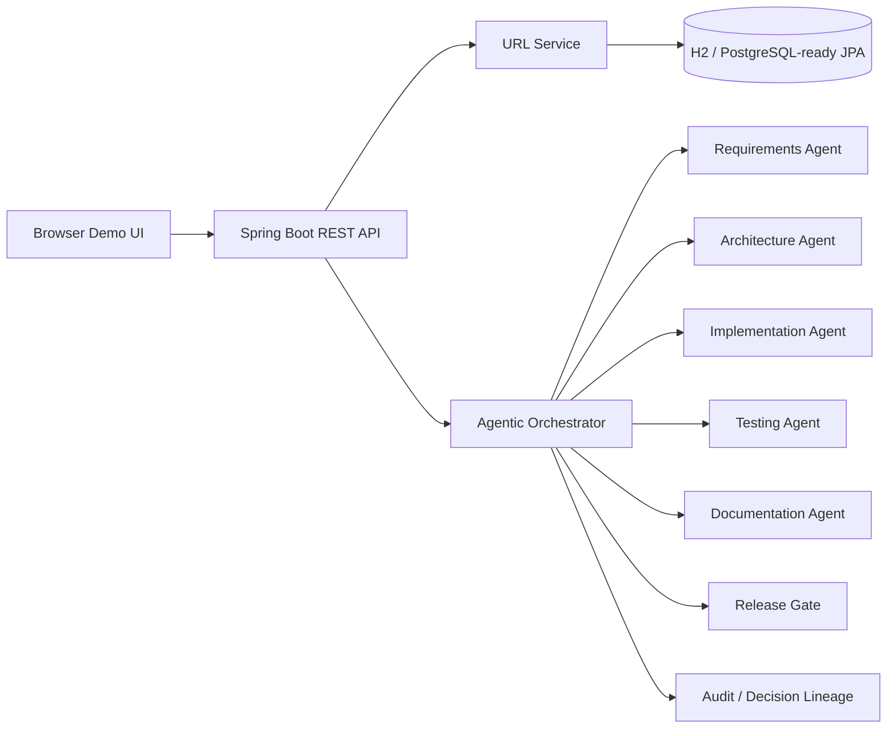
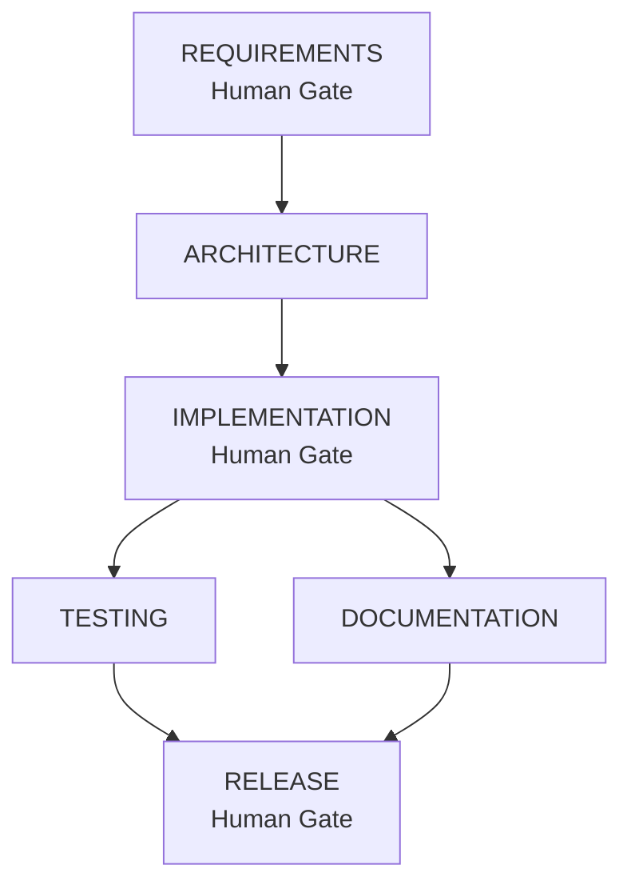

# Architecture Overview

## System view

## Orchestration DAG

Testing and documentation are independent after implementation and are executed concurrently. Release synchronizes both paths.

## Governance controls

| Control | Implementation |
|---|---|
| Dependency graph | Explicit stage dependencies in `AgenticOrchestrator` |
| Entry/exit gates | Dependency readiness + stage success checks |
| Human approval | Requirements, implementation and release gates |
| Parallel execution | Virtual-thread tasks for testing/documentation |
| Bounded retry | Maximum two retries per stage |
| Rollback | Downstream invalidation + rollback audit event |
| Safe stop | Operator endpoint and failure stop |
| Re-plan | Invalidates downstream stages when requirement changes |
| Auditability | Timestamped event lineage in workflow state |
| Reliability metrics | success ratio, retries, rollbacks, latency |
| Policy guardrail | URL validation, controlled approval boundaries, no arbitrary shell/tool execution |

## Important design decision

The prototype deliberately does not give an agent unrestricted access to the host operating system. Agent stages generate reviewable artifacts and decisions inside a bounded workflow. A production implementation can replace stage simulators with sandboxed coding agents while retaining the same gates, policy engine, audit model and rollback semantics.
